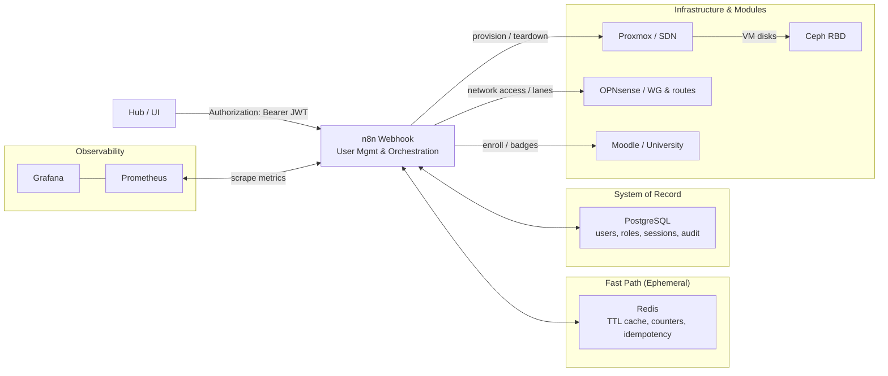

# 🧠 CyberCore: The Central Brain of CyberHub

CyberCore is the CyberHub control plane. It provides the system of record, orchestration glue, and lifecycle tracking that allows CyberHub modules to function as a coordinated platform rather than standalone services.

This repository contains CyberCore service configuration, database schema, orchestration patterns, and local development tooling.

## Responsibilities

- User provisioning and identity mapping
- Profile database (badges, allocations, progress, achievements)
- Inter-module orchestration via webhooks and API calls
- Audit logs and activity tracking
- Triggering and monitoring workflows across modules via n8n

## Flowchart



## Architecture Notes

CyberCore follows a simple control-plane pattern:

- PostgreSQL is the system of record for users, modules, resources, allocations, and audit history.
- Redis is an ephemeral fast path for workflow idempotency, counters, TTL caches, and queue coordination.
- n8n executes workflows that implement provisioning, teardown, synchronization, and module-specific operations.
- External systems such as Proxmox, OPNsense, Ceph, and Moodle are treated as providers. CyberCore stores references and state, then drives changes through workflows.

## Database Schema Overview

### Table: `app_user`

- user_id (UUID, PK, generated)
- username (unique)
- email (unique, case-insensitive)
- first_name
- last_name
- auth_provider (local, keycloak)
- password_hash (nullable, local auth only)
- password_alg (nullable, local auth only)
- status (active, inactive, suspended, banned, deleted)
- active (y/n)
- created_on
- updated_on
- last_auth_on

### Table: `app_group`

- key (PK, text; e.g., cyberlabs, crucible, library, forge, wiki, university)
- label (friendly name)
- created_on

### Table: `user_group`

- user_id (FK → app_user)
- group_key (FK → app_group)
- PK: (user_id, group_key)

### Table: `module`

- key (PK, text; e.g., cyberlabs, crucible, library, forge, wiki, university)
- name (display name)
- active (y/n)

### Table: `resource`

- resource_id (UUID, PK)
- type (vm, network, dataset, vpn_account)
- module_key (FK → module)
- name (unique within module)
- provider_ref (external ID, e.g., VMID, Ceph ID)
- metadata (JSONB; flexible spec data like vCPU, RAM, storage)
- status (available, provisioning, allocated, error, retired)
- created_on
- updated_on

### Table: `allocation`

- allocation_id (UUID, PK)
- resource_id (FK → resource)
- user_id (nullable FK → app_user)
- group_key (nullable FK → app_group)
- starts_at
- ends_at
- purpose (lab, ctf, course, project, etc.)
- quota_units (numeric quota like vCPU-hours, GB, etc.)
- metadata (JSONB; flexible extras)
- CHECK (user_id IS NOT NULL OR group_key IS NOT NULL)

### Table: `badge`

- badge_id (UUID, PK)
- key (unique, text; e.g., intro_ctf, cyberlabs_vm_master, wiki_contributor)
- name (display name)
- description (text)
- module_key (nullable FK → module; null = global badge)
- icon_url (nullable; path to badge image)
- active (y/n)
- created_on

### Table: `user_badge`

- user_id (FK → app_user)
- badge_id (FK → badge)
- earned_at (timestamp)
- awarded_by (nullable FK → app_user; who granted it)
- metadata (JSONB; e.g., evidence, score)
- PK: (user_id, badge_id)

## Quick Start

### Run Docker Compose

```bash
docker compose -f cybercore-compose.yml up -d
```

### Web Interfaces

- Adminer (Database): http://localhost:8080
- n8n (Workflows): http://localhost:5678

## Service Overview

| Service | Port | Description |
|---------|------|-------------|
| PostgreSQL | 5432 | Main database (CyberCore system of record) |
| Redis | 6379 | Ephemeral cache, counters, idempotency, queues |
| n8n | 5678 | Workflow automation and orchestration |
| Adminer | 8080 | Database web interface |

Run `./cybercore.sh` to access the interactive management interface.

## Services Included

When you start services through the CLI or scripts, the following are launched:

1. PostgreSQL Database (`cybercore-postgres`)
   - Port: 5432
   - Database: cyberhub_core
   - Username: cyberhub
   - Password: cyberpass

2. Adminer Web Interface
   - URL: http://localhost:8080
   - Use database credentials above to connect

## Environment Variables

### Database Settings

```bash
DB_HOST=your-postgres-host                   # Default: localhost
DB_PORT=5432                                 # Default: 5432
DB_NAME=your_database_name                   # Required
DB_USER=your_username                        # Required
DB_PASSWORD=your_password                    # Required
```

### n8n Settings

```bash
N8N_ENCRYPTION_KEY=your-32-char-key          # Required (generated if not set)
N8N_WEBHOOK_URL=http://localhost:5678        # Default webhook URL
```

## Database Schema

The PostgreSQL database includes tables for:

- User profiles and authentication
- Module registration and module awareness
- Resources and provider references
- Allocations and lifetime tracking
- Badges and achievements
- Activity and audit logs
- Session management

## Monitoring and Logs

CyberCore should be operated with basic observability in place. The system should capture:

- Workflow execution history and failures (n8n)
- Database health and slow queries (PostgreSQL)
- Queue and cache health (Redis)
- Provider health checks for Proxmox, OPNsense, and module APIs where applicable

Log levels are typically:

- INFO: Successful operations
- WARNING: Non-critical issues
- ERROR: Operation failures
- DEBUG: Detailed debugging information

## Troubleshooting

### Common Issues

1. Database connection errors:
   - Verify PostgreSQL is running: `docker ps | grep postgres`
   - Check credentials in `.env`
   - Ensure the database exists

2. n8n workflow issues:
   - Check n8n logs: `docker logs cybercore-n8n-webhook`
   - Verify the encryption key is set
   - Ensure Redis is running if using queue mode

3. Container startup failures:
   - Check Docker is running
   - Verify port availability
   - Review logs: `docker compose -f cybercore-compose.yml logs`

4. Permission errors:
   - Ensure proper file permissions on data directories
   - Check Docker socket permissions
   - Verify the user is in the docker group

## Support

For CyberCore issues, refer to the main CyberHub documentation in the Saguaros-CyberHub repository and open an issue in this repository for module-specific problems.