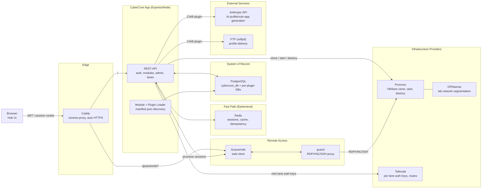

# 🧠 CyberCore: The Central Brain of CyberHub

CyberCore is the CyberHub control plane. It provides the system of record, orchestration glue, and lifecycle tracking that allows CyberHub modules to function as a coordinated platform rather than standalone services.

This repository contains CyberCore service configuration, database schema, orchestration patterns, and local development tooling.

## Responsibilities

- User provisioning, authentication (local + Keycloak), and MFA
- System-of-record database (modules, resources, allocations, badges, VM inventory)
- Direct orchestration of lab infrastructure: Proxmox (VM/lane lifecycle), Tailscale (per-lane VPN/routing), Guacamole (clientless remote access)
- Module and plugin discovery/mounting for CyberHub's feature areas (Crucible, CyberLabs, Forge, University, Library, CyberWiki, Archive)
- Audit logs and activity tracking

## Flowchart


```mermaid
flowchart LR
  %% Clients
  BROWSER["Browser<br/>Hub UI"]

  %% Edge
  subgraph EDGE["Edge"]
    CADDY["Caddy<br/>reverse proxy, auto HTTPS"]
  end
  BROWSER -->|JWT / session cookie| CADDY

  %% Application
  subgraph APP["CyberCore App (Express/Node)"]
    API["REST API<br/>auth, modules, admin, lanes"]
    LOADER["Module + Plugin Loader<br/>manifest.json discovery"]
  end
  CADDY -->|"/ "| API
  CADDY -->|"/guacamole/*"| GUAC

  %% Fast Path (Ephemeral)
  subgraph FAST["Fast Path (Ephemeral)"]
    RDS["Redis<br/>sessions, cache, idempotency"]
  end
  API <--> RDS

  %% System of Record
  subgraph SOR["System of Record"]
    PG["PostgreSQL<br/>cybercore_db + per-plugin DBs"]
  end
  API <--> PG
  LOADER --> PG

  %% Remote Access
  subgraph REMOTE["Remote Access"]
    GUAC["Guacamole<br/>web client"]
    GUACD["guacd<br/>RDP/VNC/SSH proxy"]
  end
  GUAC <--> GUACD
  API -->|provision sessions| GUAC

  %% Infrastructure Providers
  subgraph INFRA["Infrastructure Providers"]
    PVE["Proxmox<br/>VM/lane clone, start, destroy"]
    TS["Tailscale<br/>per-lane auth keys, routes"]
    OPN["OPNsense<br/>lab network segmentation"]
  end
  API -->|clone / start / destroy| PVE
  API -->|mint lane auth keys| TS
  GUACD -->|RDP/VNC/SSH| PVE
  PVE --- OPN

  %% External Services
  subgraph EXT["External Services"]
    CLAUDE["Anthropic API<br/>AI profile/vuln-app generation"]
    FTP["FTP (vsftpd)<br/>profile delivery"]
  end
  API -->|CIAB plugin| CLAUDE
  API -->|CIAB plugin| FTP
```

## Architecture Notes

CyberCore follows a simple control-plane pattern, with the Express app itself acting as the orchestrator (there is no separate workflow engine):

- PostgreSQL (`cybercore_db`) is the system of record for users, modules, resources, allocations, badges, and VM/lane inventory. Modules and plugins that need their own schema (e.g. the Crucible `ciab` and `cle` plugins) get their own auto-provisioned database, declared in their `manifest.json`.
- Redis backs sessions (via `connect-redis`) and is available as a general-purpose ephemeral cache.
- The app talks directly to providers over their native APIs: Proxmox (clone/start/destroy lab VMs and lanes), Tailscale (mint per-lane VPN auth keys for lane gateways), and Guacamole (provision remote-desktop connections backed by `guacd`).
- Caddy terminates TLS (automatic Let's Encrypt) and reverse-proxies to the app and to Guacamole; see [docs/offline-mode.md](docs/offline-mode.md) for running without HTTPS.
- OPNsense enforces network segmentation for lab lanes at the infrastructure layer; CyberCore does not call an OPNsense API directly today.
- The Anthropic API powers AI-assisted features in the Crucible `ciab` plugin (risk-assessment interviews, profile/vuln-app generation).

## Database Schema Overview

Schema lives in [config/postgres/](config/postgres/); `001_init_db.sql` creates the core tables below, `003_cyberhub_modules.sql` adds display metadata, and `config/postgres/modules/*.sql` adds per-module tables (applied selectively based on `CORE_ENABLED_MODULES`). All core tables are prefixed `cybercore_`.

### Table: `cybercore_user`

- user_id (UUID, PK, generated)
- username (unique)
- email (unique, case-insensitive)
- first_name, last_name
- organization
- email_verified (bool)
- auth_provider (local, keycloak)
- password_hash, password_alg (nullable, local auth only)
- status (active, inactive, suspended, banned, deleted)
- active (bool)
- role (user, student, admin, instructor)
- group_key (FK → cybercore_group)
- guac_password (encrypted, for auto-provisioned Guacamole connections)
- created_at, updated_at, last_auth_at
- mfa_enabled, mfa_secret, mfa_recovery_codes, mfa_enrolled_at (TOTP MFA, added idempotently at app startup)

### Table: `cybercore_group`

- key (PK, text; e.g., cyberlabs, crucible, library, forge, cyberwiki, university, archive)
- label (friendly name)
- created_at

### Table: `cybercore_user_group`

- user_id (FK → cybercore_user)
- group_key (FK → cybercore_group)
- PK: (user_id, group_key)

### Table: `cybercore_module`

- key (PK, text; e.g., cyberlabs, crucible, library, forge, cyberwiki, university, archive, and plugin keys like ciab)
- name, icon, description, entry_url, category (module/plugin), color, display_order, parent_module
- active (bool)
- Upserted at startup by the module/plugin loader from each `manifest.json` — this table drives the sidebar and `/api/modules`.

### Table: `cybercore_resource`

- resource_id (UUID, PK)
- type (vm, network, dataset, vpn_account)
- module_key (FK → cybercore_module)
- name (unique within module)
- provider_ref (external ID, e.g., Proxmox VMID)
- metadata (JSONB; flexible spec data like vCPU, RAM, storage)
- status (available, provisioning, allocated, deleting, error, retired)
- created_at, updated_at

### Table: `cybercore_allocation`

- allocation_id (UUID, PK)
- resource_id (FK → cybercore_resource)
- user_id (nullable FK → cybercore_user)
- group_key (nullable FK → cybercore_group)
- starts_at, ends_at
- purpose (lab, ctf, course, project, etc.)
- quota_units
- metadata (JSONB)
- CHECK (user_id IS NOT NULL OR group_key IS NOT NULL)

### Table: `cybercore_badge` / `cybercore_user_badge`

- `cybercore_badge`: badge_id (PK), key (unique), name, description, module_key (nullable — null = global badge), icon_url, active, created_at
- `cybercore_user_badge`: user_id + badge_id (composite PK), earned_at, awarded_by, metadata

### Tables: `cybercore_vm_template` / `cybercore_vm_instance` / `cybercore_template_catalog`

Track Proxmox VM templates and live instances used by lab provisioning: template catalog (OS images, workstation templates, lane-networking/gateway templates, challenge templates), per-module template definitions, and instance records (power state, provider node/VMID, hostname, IP, lifecycle timestamps).

### Tables: `cybercore_event` / `cybercore_lane`

Events (e.g. a CTF event or course run) and the per-user/per-event network lanes (VXLAN-isolated) provisioned for them, with status tracking (`pending` → `deploying` → `active` → `suspended`/`error`/`deleted`).

### Other core tables

- `deployed_groups` / `account_schedules` — admin batch-deploy tracking and time-gated group account access windows.
- `lane_bootstrap_tokens` — single-use bootstrap payloads delivered to lane gateways on first boot.

### Plugin-owned databases

Plugins that declare a `database` block in their `manifest.json` get an entirely separate, auto-provisioned Postgres database (not just a table prefix) — e.g. the Crucible `ciab` plugin owns `clinic_db`, and `cle` owns `cle_db`. See [docs/PLUGIN_GUIDE.md](docs/PLUGIN_GUIDE.md).

## Quick Start

### Run Docker Compose

```bash
cp example.env .env   # fill in the REPLACE_ME values
docker compose up -d
```

See [docs/offline-mode.md](docs/offline-mode.md) for running without a public domain (LAN or localhost-only modes).

### Web Interfaces

- CyberHub (via Caddy): https://\<CYBERHUB_HOST\> (or `http://localhost` in offline mode)
- Guacamole remote console: same origin, at `/guacamole/`
- Adminer (Database): http://localhost:8181
- CyberHub app directly (local debugging only, bypasses Caddy): http://127.0.0.1:3000

## Service Overview

| Service | Container | Port(s) | Description |
|---------|-----------|---------|--------------|
| Caddy | cybercore-caddy | 80, 443 | Reverse proxy, automatic HTTPS |
| CyberHub app | cybercore-app | 127.0.0.1:3000 | Express/Node application (API + server-rendered pages) |
| PostgreSQL | cybercore-postgres | 5432 | System of record (`cybercore_db` + per-plugin databases) |
| Redis | cybercore-redis | 6379 | Sessions, cache, idempotency |
| Guacamole + guacd | cybercore-guacamole, cybercore-guacd | (internal only) | Clientless remote desktop gateway, proxied by Caddy at `/guacamole/` |
| Adminer | cybercore-adminer | 8181 | Database web interface |
| FTP (vsftpd) | cybercore-ftp | 21, 21100-21110 | Profile delivery |

## Environment Variables

Copy [example.env](example.env) to `.env` and fill in the `REPLACE_ME` values. Notable groups:

```bash
# Core DB (single source of truth)
CORE_DB_USER=cyberhub
CORE_DB_PASSWORD=REPLACE_ME
CORE_DB_NAME=cybercore_db
CORE_ENABLED_MODULES=crucible,cyberlabs,forge,library,university,wiki

# App security
JWT_SECRET=REPLACE_ME
SESSION_SECRET=REPLACE_ME
VULN_ASSETS_SECRET=REPLACE_ME   # required in production (signed /vuln-assets URLs)

# Guacamole (runs inside the compose stack)
GUAC_ADMIN_USER=guacadmin
GUAC_ADMIN_PASSWORD=REPLACE_ME
GUAC_DB_PASSWORD=REPLACE_ME
GUAC_ENCRYPT_KEY=REPLACE_ME      # openssl rand -hex 32
MFA_ENCRYPT_KEY=REPLACE_ME       # openssl rand -hex 32 (falls back to GUAC_ENCRYPT_KEY)

# Proxmox
PROXMOX_API_URL=https://your-proxmox-host:8006
PROXMOX_TOKEN_ID=root@pam!clinic-app-token
PROXMOX_TOKEN_SECRET=REPLACE_ME

# Tailscale (per-lane VPN auth keys — used by lane bootstrap v2)
TAILSCALE_OAUTH_CLIENT_ID=REPLACE_ME
TAILSCALE_OAUTH_CLIENT_SECRET=REPLACE_ME
TAILSCALE_TAILNET=REPLACE_ME

# Anthropic API (AI-assisted features in the Crucible ciab plugin)
ANTHROPIC_API_KEY=REPLACE_ME
LLM_DEFAULT_MODEL=claude-sonnet-4-5

# FTP
FTP_USER=cybercore
FTP_PASSWORD=REPLACE_ME
```

## Monitoring and Logs

There is no bundled metrics stack (no Prometheus/Grafana) — operate this with whatever host-level or Docker-log-based monitoring your environment already has. Application logs are written by [front-end/src/utils/logger.js](front-end/src/utils/logger.js) (`LOG_LEVEL`, `LOG_DIR` env vars) and `console.*` calls are routed through it. Watch:

- Application logs (`docker logs cybercore-app`) for request errors, module/plugin load failures, and provisioning errors (Proxmox, Tailscale, Guacamole)
- PostgreSQL health (`docker logs cybercore-postgres`, slow queries)
- Redis health (`docker logs cybercore-redis`)
- Caddy logs for TLS/reverse-proxy issues (`docker logs cybercore-caddy`)

Log levels: INFO (successful operations), WARN (non-critical issues), ERROR (operation failures), DEBUG (detailed debugging, opt-in via `LOG_LEVEL=debug`).

## Troubleshooting

### Common Issues

1. Database connection errors:
   - Verify PostgreSQL is running and healthy: `docker ps | grep cybercore-postgres`
   - Check credentials in `.env` (`CORE_DB_USER`/`CORE_DB_PASSWORD`/`CORE_DB_NAME`)
   - Ensure the database exists and init scripts in `config/postgres/` ran without error: `docker logs cybercore-postgres`

2. App fails to start or modules don't load:
   - Check app logs: `docker logs cybercore-app`
   - Verify each module under `front-end/modules/*` has a valid `manifest.json`
   - Confirm Postgres and Redis are healthy first — the app depends on both

3. Guacamole / remote console issues:
   - Check `docker logs cybercore-guacamole` and `docker logs cybercore-guacd`
   - Verify `GUAC_DB_PASSWORD` and `GUAC_ENCRYPT_KEY` are set and match between `.env` and the running containers
   - Confirm `cybercore-guacamole-init` completed successfully (one-shot schema job)

4. Container startup failures:
   - Check Docker is running
   - Verify port availability (80/443 for Caddy, 5432, 6379, 8181, 21)
   - Review logs: `docker compose logs`

5. Permission errors:
   - Ensure proper file permissions on data directories
   - Check Docker socket permissions (the app container mounts `/var/run/docker.sock` for the CIAB vuln-app builder)
   - Verify the user is in the docker group

## Support

For CyberCore issues, refer to the main CyberHub documentation in the Saguaros-CyberHub repository and open an issue in this repository for module-specific problems.