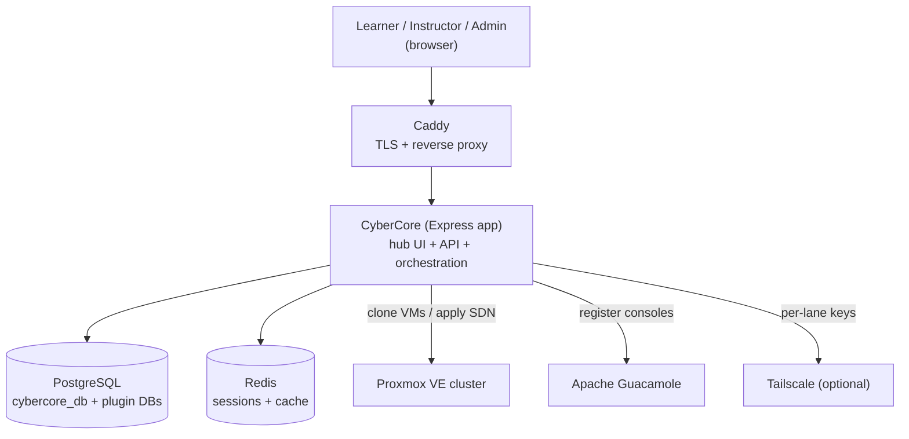

# 🧠 CyberCore

CyberCore is the **control plane** for **CyberHub**, a cyber-education platform
run by Cyber Saguaros. It's a single Node.js/Express application that serves the
hub UI, is the system of record for users and labs, and orchestrates a Proxmox VE
cluster to spin up isolated, per-user lab environments called **lanes**.

> **📚 Full documentation lives in [docs/](docs/).** Start with
> [docs/01-overview.md](docs/01-overview.md). This README is just the map and the
> quick start.

## What it actually is

- A **modular monolith**: one Express process ([front-end/src/server.js](front-end/src/server.js))
  that discovers feature **modules** and **plugins** from the filesystem at boot
  and mounts their routes.
- The **orchestrator**: it talks directly to the **Proxmox VE** API to clone VMs,
  carves per-user isolated networks out of **Proxmox SDN (VXLAN)**, and wires up
  remote access through **Apache Guacamole** and optionally **Tailscale**.
- The **system of record**: **PostgreSQL** holds users, groups, modules,
  resources, allocations, badges, VM templates/instances, events, and lanes;
  **Redis** holds sessions and caches.

The core concept is the **lane** — one user's private VXLAN network plus the VMs
attached to it (a gateway, a Kali box, and the challenge's targets). Almost
everything here exists to create, manage, and tear down lanes.

## Architecture at a glance


```mermaid
flowchart TB
  U["Learner / Instructor / Admin<br/>(browser)"] --> CADDY["Caddy<br/>TLS + reverse proxy"]
  CADDY --> APP["CyberCore (Express app)<br/>hub UI + API + orchestration"]
  APP --> PG[("PostgreSQL<br/>cybercore_db + plugin DBs")]
  APP --> RDS[("Redis<br/>sessions + cache")]
  APP -->|clone VMs / apply SDN| PVE["Proxmox VE cluster"]
  APP -->|register consoles| GUAC["Apache Guacamole"]
  APP -->|per-lane keys| TS["Tailscale (optional)"]
```

Full diagrams and the boot/request lifecycles are in
[docs/02-architecture.md](docs/02-architecture.md).

## Repository layout

| Path | What lives there |
|------|------------------|
| [front-end/](front-end/) | The Express control-plane app — this *is* CyberCore. |
| [front-end/src/](front-end/src/) | Server, module/plugin loaders, routes, middleware, orchestration utils. |
| [front-end/modules/](front-end/modules/) | Feature modules (`crucible`, `cyberlabs`, …) and their nested plugins (`ciab`, `cle`). |
| [front-end/migrations/](front-end/migrations/) | Incremental SQL migrations for `cybercore_db` (applied manually). |
| [config/postgres/](config/postgres/) | First-boot database init (fresh volume only). |
| [config/](config/) | Caddy, Guacamole, n8n, and site configuration. |
| [challenges/](challenges/) | Source for self-contained vulnerable-app challenges (e.g. CyberSaguaros). |
| [docker-compose.yml](docker-compose.yml) | The deployment stack. |
| [docs/](docs/) | The documentation set. |

## Quick start

```bash
# 1. Configure
cp example.env .env
#    …then fill in every REPLACE_ME (DB creds, JWT_SECRET, SESSION_SECRET,
#    PROXMOX_*, GUAC_*, etc. — see docs/09-deployment-and-ops.md)

# 2. Launch the stack (app + postgres + redis + guacamole + caddy + …)
docker compose up -d

# 3. Watch it come up
docker compose logs -f app
```

On first boot against an empty database volume, the `config/postgres/*` scripts
seed `cybercore_db` (schema, first admin from `ADMIN_EMAIL`, module rows); the
app then loads modules/plugins (creating `clinic_db` / `cle_db`) and starts
listening. Caddy serves the hub — a domain name in `CYBERHUB_HOST` gets automatic
HTTPS; `:80` runs HTTP-only for LAN/offline use
([docs/offline-mode.md](docs/11-offline-mode.md)).

## The modules

Discovered from [front-end/modules/](front-end/modules/) and registered in the
`cybercore_module` table:

| Module | Status | Notes |
|--------|--------|-------|
| 🔥 **The Crucible** | active | CTF-style range; the flagship lane consumer. Hosts the CiaB and CLE plugins. |
| CyberLabs · The Forge · Saguaros University · The Library · CyberWiki · The Archive | scaffolding | Registered; most currently serve placeholder pages. |

Plugins (both under Crucible): **Clinic-in-a-Box** (AI risk-assessment training,
`clinic_db`) and **Cyber Learning Environment** (instructor course tooling,
`cle_db`). See [docs/10-plugins.md](docs/10-plugins.md).

## Documentation index

| # | Doc |
|---|-----|
| 01 | [Overview](docs/01-overview.md) — what CyberCore is, glossary, system map |
| 02 | [Architecture](docs/02-architecture.md) — components, boot, request lifecycle |
| 03 | [Data Model](docs/03-data-model.md) — databases, ER map, table reference |
| 04 | [Modules & Plugins](docs/04-modules-and-plugins.md) — the loader, adding features |
| 05 | [Lanes & Provisioning](docs/05-lanes-and-provisioning.md) — the lane lifecycle |
| 06 | [Networking](docs/06-networking.md) — subnet schemes, Tailscale, Guacamole |
| 07 | [Crucible & Challenges](docs/07-crucible-challenges.md) — challenges vs. events |
| 08 | [Auth & Security](docs/08-auth-and-security.md) — JWT, roles, MFA, rate limits |
| 09 | [Deployment & Ops](docs/09-deployment-and-ops.md) — the compose stack, env, logging |
| 10 | [Plugins: CiaB & CLE](docs/10-plugins.md) — the two shipped plugins |

## Contributing

- Keep route handlers thin; put infrastructure logic in `src/utils/`.
- Write idempotent migrations — the loader re-runs plugin migrations every boot.
- **Update the matching doc in [docs/](docs/) in the same PR** when you change how
  a subsystem works. These docs are only useful if they stay honest.

## License

See [LICENSE](LICENSE).
