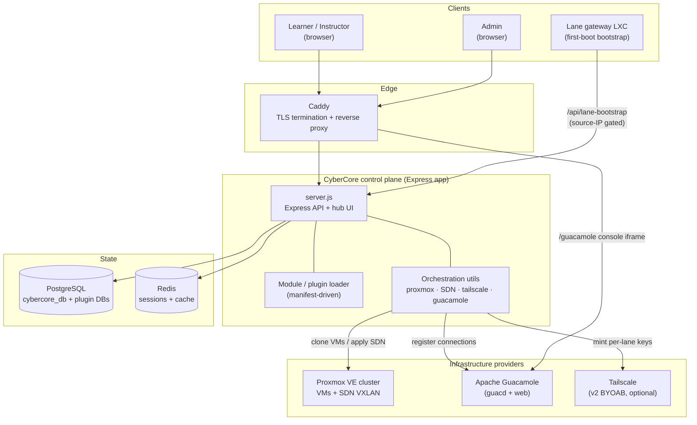

# 01 · Overview

## What CyberCore is

CyberCore is the **control plane** for CyberHub, a cyber-education platform run
by Cyber Saguaros. It is a single Node.js/Express application that:

1. **Serves the hub** — one web UI where users log in and reach every module
   (The Crucible, CyberLabs, The Forge, Saguaros University, and so on).
2. **Orchestrates infrastructure** — it talks directly to a **Proxmox VE**
   cluster to clone VMs, carves per-user isolated networks out of Proxmox
   **SDN (VXLAN)**, and wires up remote access through **Apache Guacamole** and
   optionally **Tailscale**.
3. **Is the system of record** — a PostgreSQL database tracks users, groups,
   modules, resources, allocations, badges, VM templates/instances, events, and
   the per-user lab environments called **lanes**.

The whole thing runs as a small Docker Compose stack. There is no microservice
fleet and no message bus — CyberCore is a **modular monolith**: one Express
process that discovers feature **modules** and **plugins** from the filesystem
at boot and mounts their routes.

> **Note on older docs.** Earlier drafts described an n8n-driven control plane
> with OPNsense/Ceph/Moodle providers. That is not how the system works today.
> n8n survives only as a set of *optional external workflows* used by the CiaB
> plugin for document generation ([config/n8n/workflows/](../config/n8n/workflows/));
> the core provisioning path is the Express app calling Proxmox directly.

## The one concept to understand first: the *lane*

Almost everything in CyberCore exists to create, manage, and tear down **lanes**.

A **lane** is one user's private slice of the range: an isolated VXLAN network
plus the VMs attached to it (a gateway, a Kali workstation, and whatever
vulnerable target(s) the challenge defines). Lanes are cheap to stand up and
tear down, isolated from one another, and tracked in the `cybercore_lane` table
with a lifecycle of `pending → deploying → active → suspended / error / deleted`.

When an instructor "deploys a challenge to a group," CyberCore creates one lane
per student, each with its own network and its own copy of the target VMs.

## Glossary

| Term | Meaning |
|------|---------|
| **Module** | A top-level feature area discovered from `front-end/modules/<key>/` via a `manifest.json`. Examples: `crucible`, `cyberlabs`, `forge`. Registered in `cybercore_module`. |
| **Plugin** | A nested feature that lives under a module at `modules/<module>/plugins/<key>/`, with its own manifest and often its own database. The two shipped plugins are **CiaB** and **CLE**, both under `crucible`. |
| **Lane** | One user's isolated network + VMs. The unit of provisioning. Row in `cybercore_lane`. |
| **Challenge** | A reusable, deployable scenario definition (row in `crucible_challenge`) — a spec of VMs, network, and difficulty. The catalog of things you *can* deploy. |
| **Event** | A human-run, scheduled happening (a live CTF, a KotH match, a red-vs-blue session). Row in `cybercore_event`. Distinct from a challenge. |
| **Resource** | A tracked provisioned thing (a VM, network, dataset, VPN account). Row in `cybercore_resource`, with `cybercore_vm_instance` holding VM specifics. |
| **Allocation** | A link that grants a user or group access to a resource for a purpose and time window. Row in `cybercore_allocation`. |
| **Subnet scheme (v1/v2/v3)** | The networking topology a lane uses — which gateway VM template and IP plan. See [06-networking.md](06-networking.md). |
| **Attachable module/challenge** | A challenge that can be hot-attached into an existing lane (e.g. CyberSaguaros), rather than defining the lane itself. |
| **Template catalog** | `cybercore_template_catalog` — the registry of Proxmox VM templates (OS images, workstations, lane gateways, single-VM challenges) the orchestrator clones from. |

## Top-level system map

## The layout of the repo, at a glance

| Path | What lives there |
|------|------------------|
| [front-end/](../front-end/) | The Express control-plane app — this is CyberCore. |
| [front-end/src/](../front-end/src/) | Server, loaders, routes, middleware, and orchestration utils. |
| [front-end/modules/](../front-end/modules/) | Feature modules and their nested plugins. |
| [front-end/migrations/](../front-end/migrations/) | Schema migrations applied to the main database. |
| [config/postgres/](../config/postgres/) | First-boot database init scripts (run once on a fresh volume). |
| [config/](../config/) | Caddy, Guacamole, n8n, and site configuration. |
| [challenges/](../challenges/) | Source for self-contained vulnerable-app challenges (e.g. CyberSaguaros). |
| [docker-compose.yml](../docker-compose.yml) | The deployment stack. |
| [docs/](.) | You are here. |

Continue to **[02 · Architecture](02-architecture.md)** for how these pieces
fit together at runtime.
