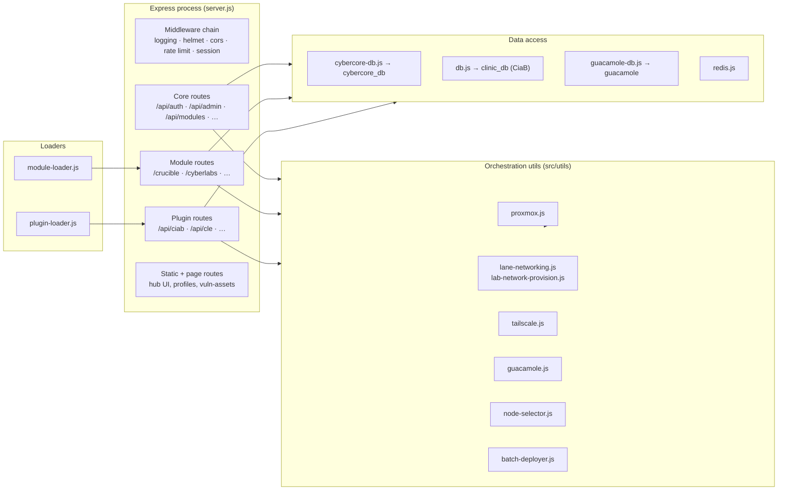
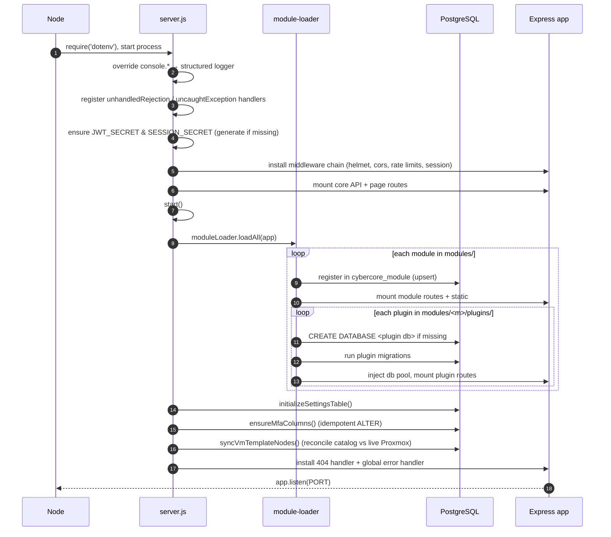
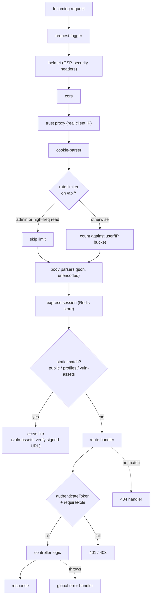
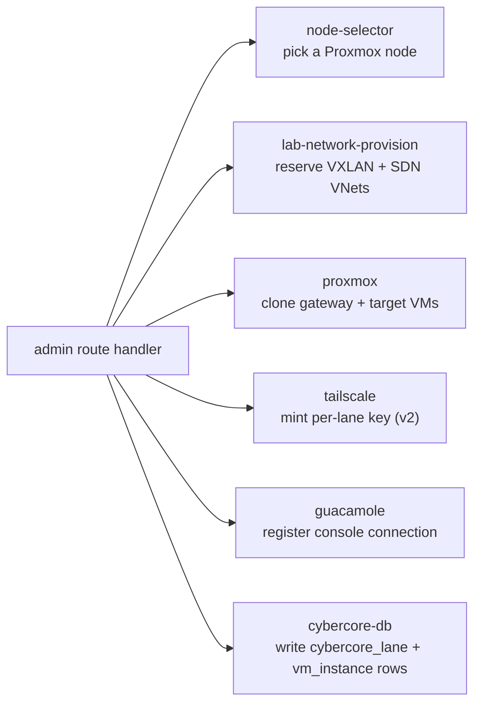

# 02 · Architecture

This doc explains how CyberCore is put together at runtime: the components, how
the process boots, and the path a request takes through it.

## Components

CyberCore is a **modular monolith**. One Express process ([front-end/src/server.js](../front-end/src/server.js))
hosts everything; features are composed in from the filesystem at boot.

### The layers

- **Middleware chain** — cross-cutting concerns applied to every request
  (logging, security headers, CORS, rate limiting, body parsing, sessions).
  Order matters; see the request lifecycle below.
- **Core routes** ([src/routes/](../front-end/src/routes/)) — auth, admin,
  lab templates, modules, workstations, lane bootstrap, and Guacamole sessions.
  Wired explicitly in `server.js`.
- **Module & plugin routes** ([src/module-loader.js](../front-end/src/module-loader.js))
  — discovered and mounted at boot from `manifest.json` files. Covered in
  [04-modules-and-plugins.md](04-modules-and-plugins.md).
- **Orchestration utils** ([src/utils/](../front-end/src/utils/)) — the code
  that actually drives infrastructure. Each has a single responsibility (talk to
  Proxmox, carve SDN networks, mint Tailscale keys, register Guacamole
  connections, pick a node, deploy lanes in batches).
- **Data access** — thin pooled-`pg` wrappers, one per database (see
  [03-data-model.md](03-data-model.md)), plus a Redis client for sessions and
  caching.

## Boot sequence

`server.js` runs top-to-bottom, then calls `start()`. The important part is that
**modules and plugins load *after* the middleware and core routes are wired, but
*before* the server starts listening** — so a module can register its routes and
provision its own database before the first request arrives.

A few boot behaviors worth knowing:

- **Secrets are self-healing but ephemeral.** If `JWT_SECRET` / `SESSION_SECRET`
  are unset, the server generates random ones and logs a warning — usable for
  dev, but every restart invalidates all tokens/sessions. Always set them in
  production. ([server.js:94](../front-end/src/server.js#L94))
- **Idempotent schema top-ups.** `config/postgres/*` init scripts only run on a
  *fresh* database volume, so `server.js` re-ensures a few things at every boot
  (`settings` table, MFA columns) via `IF NOT EXISTS` / `ADD COLUMN IF NOT
  EXISTS`. This is how existing deployments pick up new columns without a
  migration runner.
- **Template node reconciliation.** `syncVmTemplateNodes()` queries the live
  Proxmox cluster and corrects the `node` column in `cybercore_template_catalog`
  when a template has been migrated between nodes — so clone operations target
  the right host.
- **Module loading is non-fatal.** If a module throws during load, the error is
  logged and the server still starts. A broken module degrades that feature
  rather than taking down the hub.

## Request lifecycle

Every request passes through the middleware chain in this order. The order is
deliberate — for example, `cookie-parser` runs *before* the rate limiter so the
limiter can read the JWT cookie and skip admins.

### Rate limiting, specifically

There are three separate limiters ([server.js:201](../front-end/src/server.js#L201)):

| Limiter | Scope | Cap | Key |
|---------|-------|-----|-----|
| `limiter` | all `/api/*` | `RATE_LIMIT_MAX_REQUESTS` (default 5000 / 15 min) | user ID if logged in, else IP |
| `authLimiter` | `/api/auth/login`, `/api/auth/register` | 5 / 15 min | login email, else IP |
| `webhookLimiter` | `/api/webhook` | 10 / min | IP |

The general limiter **skips admins entirely** and skips high-frequency read
endpoints (`/api/auth/me`, `*/status` polls) so a normal active session doesn't
exhaust its own bucket. Login brute-force protection is handled separately and
stays tight regardless. See [08-auth-and-security.md](08-auth-and-security.md).

### Authentication

Route handlers that need identity call `authenticateToken` (verifies the JWT
from the `Authorization: Bearer` header or the `token` cookie) and optionally
`requireRole('admin' | 'instructor')`. The three effective roles are **admin**,
**instructor**, and regular **user**. Details in
[08-auth-and-security.md](08-auth-and-security.md).

## Where infrastructure work happens

Route handlers stay thin; the heavy lifting lives in `src/utils/`. When an admin
deploys a lane, the request handler orchestrates a sequence of util calls:

The full deploy sequence — including subnet schemes and gateway bootstrapping —
is documented in [05-lanes-and-provisioning.md](05-lanes-and-provisioning.md)
and [06-networking.md](06-networking.md).

Continue to **[03 · Data Model](03-data-model.md)**.
