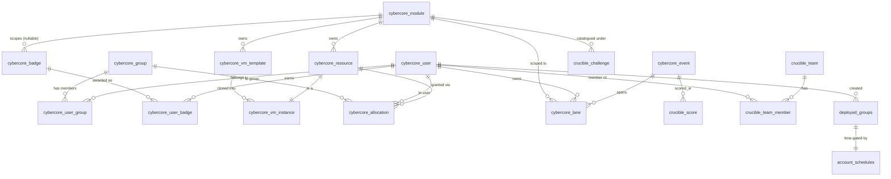

# 03 · Data Model

CyberCore persists everything durable in **PostgreSQL** and uses **Redis** only
for ephemeral state (sessions, caches). This doc covers the databases, the core
entity relationships, and a per-table reference.

## The databases

There is not one database — there are several, each reached through its own
connection pool. Keeping them separate is deliberate: a plugin owns its data and
can't accidentally reach into the control plane's tables.

| Database | Default name | Pool / accessor | Owned by | Holds |
|----------|-------------|-----------------|----------|-------|
| **CyberCore** | `cybercore_db` | [cybercore-db.js](../front-end/src/utils/cybercore-db.js) → `cybercoreQuery()` | control plane | Users, groups, modules, resources, allocations, badges, VM templates/instances, events, **lanes**, challenges. The system of record. |
| **Clinic** | `clinic_db` | [db.js](../front-end/src/utils/db.js) → `query()` | **CiaB** plugin | Risk-assessment profiles, intakes, generated documents, findings. See [10-plugins.md](10-plugins.md). |
| **CLE** | `cle_db` | plugin-injected pool | **CLE** plugin | Courses, enrollments, materials, submissions. |
| **Guacamole** | `guacamole_db` | Guacamole itself + [guacamole-db.js](../front-end/src/utils/guacamole-db.js) | Guacamole | Connection definitions and its own users. Managed by the Guacamole containers. |
| **Redis** | — | [redis.js](../front-end/src/utils/redis.js) | control plane | Session store (`connect-redis`) and short-lived caches. |

### Where the schema comes from

Three different mechanisms create/maintain schema — know which is which:

1. **First-boot init — `config/postgres/`.** Scripts like
   [001_init_db.sql](../config/postgres/001_init_db.sql) and
   [modules/crucible.sql](../config/postgres/modules/crucible.sql) run **once**,
   the first time the Postgres container initializes an empty data volume. This
   is the authoritative starting schema for `cybercore_db`. Re-running requires
   a fresh volume.
2. **Incremental migrations — `front-end/migrations/`.** Numbered `.sql` files
   (e.g. [007_cybercore_tables.sql](../front-end/migrations/007_cybercore_tables.sql),
   [021_subnet_scheme_v3.sql](../front-end/migrations/021_subnet_scheme_v3.sql))
   that evolve `cybercore_db` after init. **There is no automatic runner** — an
   operator applies them with `psql`. Most are written idempotently
   (`IF NOT EXISTS`).
3. **Plugin migrations — applied by the loader.** When a plugin manifest
   declares a `database`, the module loader creates that database if missing and
   runs the plugin's own migrations directory on boot. This is the *only*
   automatic migration path. See [04-modules-and-plugins.md](04-modules-and-plugins.md).

> Additionally, `server.js` re-ensures a couple of things every boot
> (`settings` table, MFA columns) so long-lived deployments pick up small schema
> additions without a manual migration. See [02-architecture.md](02-architecture.md).

## Core entity-relationship map (`cybercore_db`)

These are the control-plane tables and their relationships. Columns are
abbreviated; see the reference below and the SQL for the full definitions.

### How to read this

- **Identity & access:** `cybercore_user` + `cybercore_group` (many-to-many via
  `cybercore_user_group`) drive who you are and what you can see. `cybercore_badge`
  / `cybercore_user_badge` track achievements.
- **The provisioning triangle:** a **module** owns **resources** and **VM
  templates**; a **resource** of type `vm` has exactly one **vm_instance**;
  instances are cloned *from* templates. **Allocations** grant a user or group
  time-boxed access to a resource.
- **The runtime unit:** a **lane** belongs to a user, is scoped to a module,
  and optionally rolls up under an **event**. This is what
  [05-lanes-and-provisioning.md](05-lanes-and-provisioning.md) is all about.
- **Crucible catalog:** **challenges** (`crucible_challenge`) are the reusable
  scenario definitions; **events**/`crucible_score`/`crucible_team*` support
  live, scored competitions. The distinction is covered in
  [07-crucible-challenges.md](07-crucible-challenges.md).

## Key-table reference

### Identity & access

| Table | Purpose | Notable columns |
|-------|---------|-----------------|
| `cybercore_user` | Accounts. | `user_id` (UUID PK), `email` (unique), `role`, `status`, `mfa_enabled`, `mfa_secret`, `mfa_recovery_codes` |
| `cybercore_group` | Cohorts / module groups. | `key` (PK), `label` |
| `cybercore_user_group` | User↔group membership. | PK `(user_id, group_key)` |
| `cybercore_badge` / `cybercore_user_badge` | Achievements and grants. | `module_key` nullable = global badge; grant has `earned_at`, `awarded_by` |

### Modules & catalog

| Table | Purpose | Notable columns |
|-------|---------|-----------------|
| `cybercore_module` | Registry of modules and plugins (upserted by the loader). | `key` (PK), `category` (`module`/`plugin`), `parent_module`, `entry_url`, `active`, `display_order` |
| `cybercore_template_catalog` | All Proxmox VM templates the orchestrator can clone. | `template_vmid`, `node` (reconciled at boot), `template_type` (`os_template`/`workstation`/`lane_networking`/`challenge`), `os_family`, `os_version` |
| `vuln_scripts` | Library of vulnerability-injection scripts run on deployed VMs. | script body/metadata; resolved by [vuln-script-resolver.js](../front-end/src/utils/vuln-script-resolver.js) |

### Resources & instances

| Table | Purpose | Notable columns |
|-------|---------|-----------------|
| `cybercore_resource` | Any provisioned thing (vm/network/dataset/vpn_account). | `type`, `module_key`, `provider_ref`, `status` |
| `cybercore_vm_template` | Logical VM templates per module (role, runtime). | `module_key`, `role`, `default_runtime_min` |
| `cybercore_vm_instance` | A live VM. 1:1 with a resource. | `provider`, `provider_node`, `provider_vmid`, `power_state`, `ip_address`, `vlan_id`, `auto_sleep_at` |
| `cybercore_allocation` | Time-boxed grant of a resource to a user or group. | `starts_at`, `ends_at`, `purpose`, CHECK: user or group must be set |

### Lanes, events & challenges

| Table | Purpose | Notable columns |
|-------|---------|-----------------|
| `cybercore_lane` | A user's isolated network + VMs. | `status` (enum `pending`→`deleted`), `vxlan_id`, `module_key`, `config` JSONB. Unique vxlan among non-error/deleted lanes. |
| `cybercore_event` | A scheduled, human-run happening. | `name`, `starts_at`, `ends_at`, plus event-type columns added by `crucible.sql` |
| `crucible_challenge` | Reusable scenario catalog. | `challenge_key`, `challenge_type` (`single_vm`/`multi_vm`/`koth`/`red_vs_blue`/`other`), `difficulty`, `subnet_scheme` (`v1`/`v2`/`v3`), `spec` JSONB, `status` |
| `crucible_score` / `crucible_team` / `crucible_team_member` / `crucible_lane_group` | Scoring and team structure for competitions. | scores keyed by `event_id`; teams group users |

### Operations

| Table | Purpose | Notable columns |
|-------|---------|-----------------|
| `deployed_groups` | Admin batch-deploy tracking. | `group_name`, `config` JSONB, `created_by` |
| `account_schedules` | Time-gates group accounts (active days/hours, TZ, override). | one row per `deployed_groups.id` |
| `lane_bootstrap_tokens` | One-shot payloads a lane gateway pulls on first boot. | PK `vxlan_id`, `wan_ip`, `payload`, `expires_at`, `consumed_at`. See [05](05-lanes-and-provisioning.md). |
| `cybercore_site_settings` / `settings` | Site configuration key/values. | `key` PK |
| `instructor_working_sets`, `deployment_vuln_selections`, `challenge_templates`, `generated_documents` | Instructor authoring & deployment bookkeeping. | JSONB-heavy; some predate the CiaB→CyberCore split and also appear in `clinic_db` |

> **Module-specific tables** (`cyberlabs_lab`, `cyberlabs_vm_request`,
> `forge_project`, `forge_artifact`, `university_course`, `university_enrollment`)
> exist as scaffolding for their respective modules. Most of those modules ship
> as placeholder UIs today (see the `placeholderModules` list in
> [server.js](../front-end/src/server.js)), so treat these tables as reserved
> until the module is built out.

## Plugin databases (summary)

Plugin schemas are owned by the plugin and detailed in
[10-plugins.md](10-plugins.md). At a glance:

- **`clinic_db` (CiaB)** — the largest plugin schema: `profiles`, `intakes`,
  `real_client_intakes`, `risk_assets`/`risk_findings`/`risk_snapshots`,
  `cis_ram_*`, `security_documents`, `generated_documents`, `interview_sessions`,
  `nice_framework_reference`, and more.
- **`cle_db` (CLE)** — small and focused: `cle_course`, `cle_course_enrollment`,
  `cle_course_material`, `cle_student_submission`, `cle_activity_log`.

---

That's the foundation. The next batch of docs builds on it:
modules/plugins loading (04), the lane lifecycle (05), networking (06),
challenges (07), auth (08), and ops (09).
