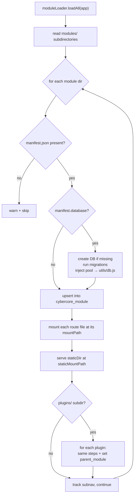

# 04 · Modules & Plugins

CyberCore's features are not hard-wired into `server.js`. They're **discovered
from the filesystem at boot** and mounted dynamically. This is what makes the
platform extensible: drop a directory with a `manifest.json` into `modules/` and
it becomes part of the app.

## Modules vs. plugins

| | Module | Plugin |
|---|--------|--------|
| Lives in | `front-end/modules/<key>/` | `front-end/modules/<module>/plugins/<key>/` |
| Manifest | `manifest.json` | `manifest.json` |
| `category` | `module` | `plugin` |
| `parent_module` | — | the module it nests under |
| Own database? | rarely | commonly (`clinic_db`, `cle_db`) |
| Example | `crucible`, `cyberlabs`, `forge` | `ciab`, `cle` (both under `crucible`) |

A **module** is a top-level feature area. A **plugin** is a feature that belongs
to a module and is namespaced beneath it. Both are loaded by the same code and
share the same manifest shape — a plugin is really just a module with a
`parent_module` and (usually) its own database.

> **Heads-up — one loader is live, one is dormant.**
> [src/module-loader.js](../front-end/src/module-loader.js) is the real loader;
> `server.js` calls `moduleLoader.loadAll(app)`. There is a second file,
> `src/plugin-loader.js`, that scans a top-level `plugins/` directory for
> `plugin.json` files — `server.js` **never requires or invokes it**, so it does
> nothing today (even though `docker-compose.yml` still mounts an empty
> `front-end/plugins` volume). Treat it as legacy; prefer deleting it. If you
> copy a manifest from there you'll get subtly wrong field names
> (`entryUrl`/`displayOrder` instead of `entry_url`/`display_order`).

## The manifest

A `manifest.json` describes one module or plugin. Here is the full shape, with
every field the loader reads:

```jsonc
{
  "key": "crucible",                 // unique id; PK in cybercore_module
  "name": "The Crucible",            // display name
  "icon": "🔥",                       // emoji or icon shown in the hub
  "description": "CTF-style range…", // shown in the hub
  "entry_url": "/crucible/dashboard",// where the hub tile links
  "category": "module",              // "module" | "plugin"
  "color": "#f56565",                // accent color in the UI
  "active": true,                    // false = registered but hidden
  "display_order": 1,                // sort order in the hub/sidebar
  "parent_module": "crucible",       // plugins only: the owning module

  // Express routers to mount. Each file exports an express.Router().
  "routes": [
    { "file": "routes/pages.js",  "mountPath": "/crucible" },
    { "file": "routes/events.js", "mountPath": "/" }
  ],

  // Static assets served verbatim.
  "staticDir": "public",
  "staticMountPath": "/crucible",

  // Plugins that need their own database declare it here. The loader creates
  // the DB if missing and runs every .sql in the migrations dir (sorted).
  "database": {
    "name": "clinic_db",
    "migrations": "migrations"
  },

  // Sidebar navigation contributed to the hub shell.
  "subnav": {
    "label": "Challenge Types",
    "items": [
      { "label": "Vulnerable Boxes", "icon": "💀", "url": "/crucible/dashboard?type=vuln", "page": "vuln" },
      { "label": "Instructor", "icon": "👨‍🏫", "url": "/ciab/instructor", "page": "instructor", "roles": ["instructor", "admin"] }
    ]
  }
}
```

### Field notes

- **`routes[].mountPath`** — the Express mount prefix. A router mounted at `/`
  that defines `/api/crucible/events` resolves to exactly that path; a router
  mounted at `/crucible` that defines `/dashboard` resolves to
  `/crucible/dashboard`. Both patterns are used in the codebase — check the
  router file to see which the paths assume.
- **`database`** — only meaningful for things that own data. When present, the
  loader `CREATE DATABASE`s it (outside a transaction) if missing, runs the
  migrations, and injects a `pg` pool into the module's own `utils/db.js` via
  its exported `setPool()`. That's how `query()` inside a plugin talks to the
  right database.
- **`subnav.items[].roles`** — optional; restricts a nav entry to certain roles
  (e.g. instructor/admin-only links). Absence means everyone sees it.

## What the loader does (per module)



Concretely, for every module the loader
([module-loader.js](../front-end/src/module-loader.js)):

1. Parses `manifest.json` (skips the dir with a warning if absent).
2. If `database` is declared, provisions it and runs migrations.
3. **Upserts** the manifest into `cybercore_module` (`ON CONFLICT (key) DO
   UPDATE`) so `/api/modules` and the hub can discover it.
4. Mounts each `routes[]` router at its `mountPath`.
5. Serves `staticDir` at `staticMountPath`.
6. Recurses into `plugins/` and repeats, tagging each plugin with
   `parent_module`.
7. Records `subnav` in memory for the sidebar API.

Loading is **resilient**: a throw in one module is logged and the loop
continues, so a broken feature won't stop the server from booting.

## How the hub finds features at runtime

The loader writes every module/plugin into `cybercore_module`. The hub UI and
`/api/modules` read from that table, so the navigation is data-driven — no
front-end code change is needed to surface a new module. The in-memory `subnav`
registry supplies the per-module sidebar sections.

## Walkthrough: add a new module

Say you want a `cyberprobe` module.

1. **Create the directory and manifest.**
   ```
   front-end/modules/cyberprobe/
     manifest.json
     routes/pages.js
     public/pages/dashboard.html
   ```
   ```json
   {
     "key": "cyberprobe",
     "name": "CyberProbe",
     "icon": "📡",
     "description": "Network reconnaissance range",
     "entry_url": "/cyberprobe/dashboard",
     "category": "module",
     "color": "#38b2ac",
     "active": true,
     "display_order": 5,
     "routes": [{ "file": "routes/pages.js", "mountPath": "/cyberprobe" }],
     "staticDir": "public",
     "staticMountPath": "/cyberprobe"
   }
   ```

2. **Write the router.** `routes/pages.js` exports an `express.Router()`:
   ```js
   const express = require('express');
   const path = require('path');
   const router = express.Router();
   router.get('/dashboard', (req, res) =>
     res.sendFile(path.join(__dirname, '../public/pages/dashboard.html')));
   module.exports = router;
   ```

3. **Restart the app.** On boot you'll see the module registered and its routes
   mounted; the hub tile appears automatically.

### Add a plugin instead

Same steps, but the directory goes under a module
(`modules/crucible/plugins/cyberprobe/`), the manifest sets
`"category": "plugin"` and `"parent_module": "crucible"`, and if it needs
storage you add a `database` block plus a `utils/db.js` that exposes
`setPool()`. Model it on [the CiaB plugin](../front-end/modules/crucible/plugins/ciab/)
(see [10-plugins.md](10-plugins.md)).

## Conventions worth following

- **Keep routers thin.** Put infrastructure logic in `src/utils/` (shared) or a
  plugin-local `utils/`, not in the route handler.
- **Namespace your API paths** under `/api/<key>/…` to avoid collisions with
  core and other plugins.
- **Write idempotent migrations** (`CREATE TABLE IF NOT EXISTS`, `ADD COLUMN IF
  NOT EXISTS`). The loader re-runs the whole migrations directory every boot and
  only logs failures — it does not track which migrations have already applied.
- **Prefix your tables** with your key (`cle_*`) so the database stays legible.

Continue to **[05 · Lanes & Provisioning](05-lanes-and-provisioning.md)**.
