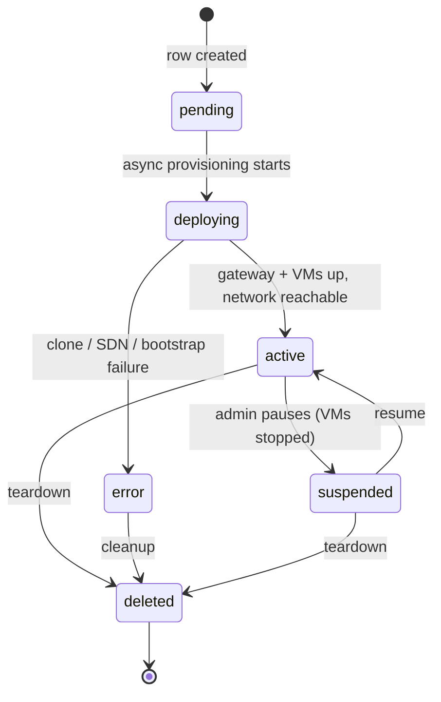
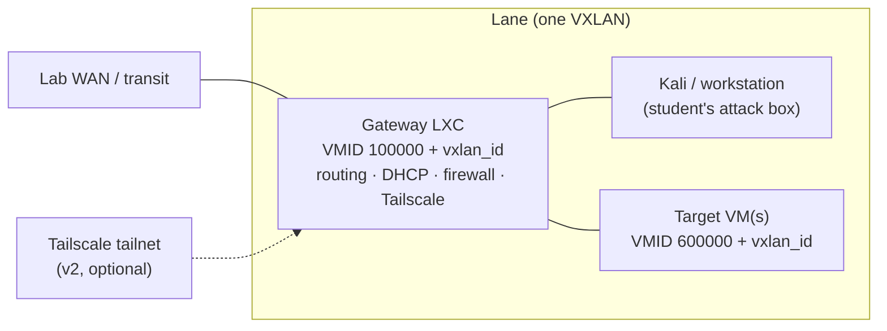
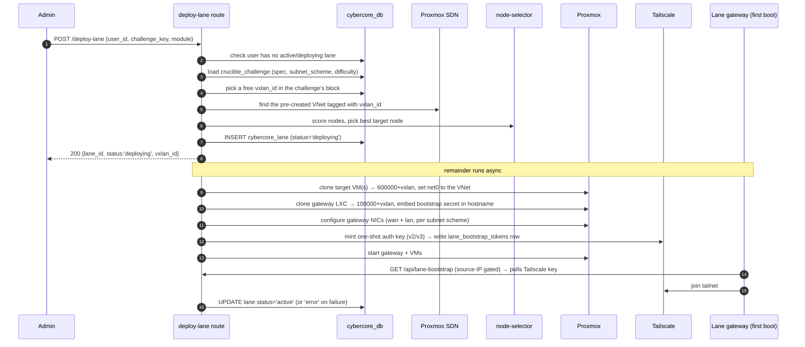
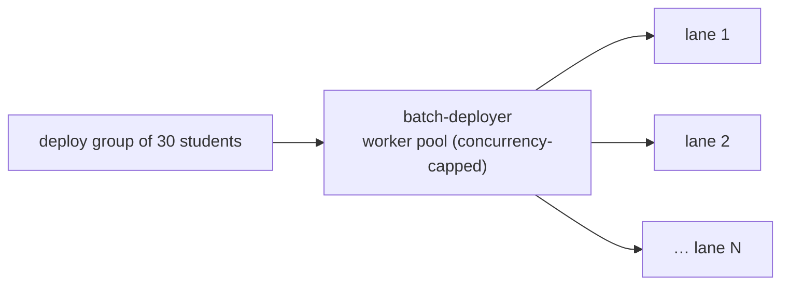

# 05 · Lanes & Provisioning

This is the heart of CyberCore: turning a **challenge** definition into a
running, isolated **lane** on the Proxmox cluster. If you only read one deep-dive
doc, make it this one.

## The lane lifecycle

A lane is a row in `cybercore_lane` with a status enum. The happy path is
`pending → deploying → active`, with `suspended`, `error`, and `deleted` as the
off-ramps.

Two details that matter operationally:

- **One active lane per user.** Deploy refuses if the user already has a lane in
  `active`, `deploying`, or `pending` ([lanes.js:65](../front-end/src/routes/admin/lanes.js#L65)).
- **VXLAN IDs are recycled.** The unique index on `vxlan_id` only applies to
  non-`error`/`deleted` lanes, so a failed deploy releases its VXLAN for reuse
  on retry (see [03-data-model.md](03-data-model.md)).

## Anatomy of a lane

Every lane has, at minimum, a **gateway** and the challenge's **target VMs**, all
on one private VXLAN network:

- **Gateway** — an LXC cloned from a lane-gateway template (VMID depends on the
  subnet scheme; see [06-networking.md](06-networking.md)). It does the routing,
  DHCP, firewalling, and — for v2/v3 — joins a Tailscale tailnet so the student
  can reach the lane remotely.
- **Targets** — QEMU VMs (or LXCs) cloned from challenge templates. Their VMIDs
  are `vm_offset + vxlan_id` (default offset `600000`), keeping them
  cluster-unique and deterministically tied to the lane.

The VMID math is the trick that keeps everything collision-free without a
central allocator: gateway = `100000 + vxlan_id`, targets = `600000 + vxlan_id`,
attached-module VMs = `800000 + slot*10000 + vxlan_id`. Given a small VXLAN
range, no two lanes ever compute the same VMID.

## The deploy sequence

`POST /api/admin/deploy-lane` ([lanes.js:41](../front-end/src/routes/admin/lanes.js#L41))
is the single-lane entry point. It responds *immediately* with `status:
deploying` and continues the actual provisioning in a background async block —
so the caller polls `GET /api/admin/lanes/:id` for progress rather than blocking
on a multi-minute clone.

### Step-by-step

1. **Guard.** Reject if the user already has a live lane.
2. **Load the challenge.** Read `spec`, `subnet_scheme`, and `difficulty` from
   `crucible_challenge` (must be `status='active'`).
3. **Reserve a VXLAN.** Pick the lowest free `vxlan_id` in the challenge's
   configured block (default `10000–10009`), computed as a set difference
   against in-use lanes.
4. **Resolve the VNet.** The SDN VNets are **pre-created** per VXLAN (see below),
   so deploy just finds the VNet whose tag equals `vxlan_id`. For v3 it also
   resolves the paired internal VNet (`vxlan_id + offset`).
5. **Select a node.** [node-selector.js](../front-end/src/utils/node-selector.js)
   scores every Proxmox node on free CPU/RAM and returns the best host.
6. **Insert the lane row** as `deploying` and return to the caller.
7. **Clone targets** (async). For each VM in `spec.vms` (or a single default
   VM), clone the template to `vm_offset + vxlan_id`, then set its NIC(s) onto
   the lane VNet. GOAD and DMZ roles get special multi-NIC / MAC handling (see
   [goad-deploy.js](../front-end/src/utils/goad-deploy.js)).
8. **Clone + wire the gateway.** Clone the gateway LXC to `100000 + vxlan_id`,
   embedding a random **bootstrap secret** in its hostname
   (`…-b<16hex>`), and configure its WAN + LAN interfaces per the subnet scheme.
9. **Prime bootstrap + Tailscale.** For v2/v3, mint a one-shot Tailscale auth key
   and write a `lane_bootstrap_tokens` row keyed to the gateway's expected WAN IP.
10. **Start everything**, then flip the lane to `active` (or `error`).

### First-boot bootstrap (how the gateway gets its secrets)

The gateway has no credentials when it's born — a chicken/egg problem. It solves
this by **pulling** its config on first boot from an unauthenticated but gated
endpoint:

- The gateway calls `GET /api/lane-bootstrap`
  ([lane-bootstrap.js](../front-end/src/routes/lane-bootstrap.js)).
- The request is matched to a `lane_bootstrap_tokens` row by **source IP**
  (the WAN IP the orchestrator deterministically assigned). Express's
  `trust proxy` config ensures `X-Forwarded-For` can't be spoofed by a
  lab-network attacker.
- The payload (Tailscale auth key, tags, hostname) is returned and the row is
  **marked consumed** — it's one-shot. A hostname-embedded random secret adds a
  second factor.

This "push a token row, gateway pulls once" pattern keeps secrets out of the
cloned image and out of any long-lived store.

## Group deployment (many lanes at once)

Instructors deploy to a whole cohort, not one student. That path fans the
single-lane logic out through [batch-deployer.js](../front-end/src/utils/batch-deployer.js),
a worker pool that provisions **N lanes concurrently** (bounded by
`max_concurrent_lanes` / `max_concurrent_clones` from site config) instead of a
slow sequential loop. Each worker runs the same clone-and-wire sequence above.

## Attached modules (runtime add-ons)

Sometimes you want to graft extra VMs onto an **already-running** lane — e.g. the
instructor adds a DVWA box to every student lane in week 3, then removes it in
week 4, without disturbing the base lane. That's an **attached module**
([attached-modules.js](../front-end/src/utils/attached-modules.js)):

- Attached VMs sit on the **same VXLAN** as the base lane, reachable from the
  student's Kali at `<lane_subnet>.<octet>`.
- VMIDs use a slot scheme: `800000 + slot*10000 + vxlan_id`, giving **10 slots**
  per lane. A multi-VM module consumes consecutive slots.
- DHCP reservations are written to a per-instance file on the gateway, so detach
  is a clean single-file delete + `dnsmasq` reload.

API: `POST /api/admin/lanes/:laneId/modules` to attach,
`DELETE /api/admin/lanes/:laneId/modules/:moduleInstanceId` to detach
([lanes.js:550](../front-end/src/routes/admin/lanes.js#L550)). This is how the
CyberSaguaros challenge is delivered — see [07-crucible-challenges.md](07-crucible-challenges.md).

## Teardown

`DELETE /api/admin/lanes/:id` stops and destroys the gateway and all lane VMs on
Proxmox, cleans up the Tailscale device (v2/v3), and marks the lane `deleted`.
Because VXLAN IDs and VMIDs are deterministic functions of `vxlan_id`, teardown
knows exactly which resources to remove.

Continue to **[06 · Networking](06-networking.md)** for the subnet schemes and
gateway internals referenced throughout this doc.
