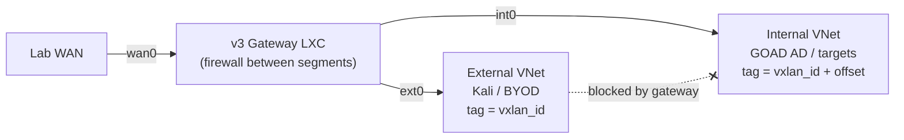
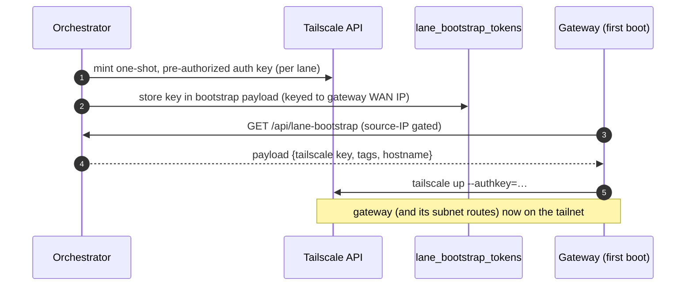
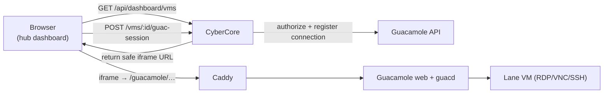

# 06 · Networking

Every lane is an isolated network. This doc covers how that isolation is built —
the three **subnet schemes**, the lane **gateway**, remote access via
**Tailscale**, and in-browser VM consoles via **Guacamole**.

## SDN + VXLAN, in one paragraph

CyberCore uses **Proxmox SDN** to give each lane its own layer-2 segment. A lane
is assigned a `vxlan_id`; a Proxmox SDN **VNet** tagged with that ID provides an
isolated bridge that materializes on the cluster nodes. VNets are **pre-created**
in bulk (see [lab-network-provision.js](../front-end/src/utils/lab-network-provision.js)),
so deploying a lane is a fast "find the VNet with my tag and attach VMs to it"
rather than a slow SDN apply on the critical path. Because the SDN apply is
asynchronous, the provisioning helper **polls until the VNet bridge appears** on
the nodes before a lane deploy relies on it.

## The three subnet schemes

The `subnet_scheme` column on `crucible_challenge` selects the network topology a
lane uses. It picks which **gateway template** to clone and how addresses are
laid out. Logic lives in [lane-networking.js](../front-end/src/utils/lane-networking.js).

| | **v1** (legacy) | **v2** (default for new) | **v3** (segmented) |
|---|---|---|---|
| Gateway template VMID | 1692 / 1691 / 1693 | **1694** | **1695** |
| Lane subnet | shared `192.18.0.0/24` | unique `10.<vxlan_hi>.<vxlan_lo>.0/24` | two VNets: external + internal `/24` |
| Gateway WAN | per-module transit `100.102.0.0/16` | directly on lab bridge `100.100.60.x/24` | segmented WAN + ext0 + int0 |
| Tailscale BYOAB | ✗ | ✓ | ✓ |
| VNets per lane | 1 | 1 | **2** (`vxlan_id` and `vxlan_id + offset`) |
| Use case | pre-existing challenges | modern single/multi-VM labs | DMZ-pivot / GOAD attack paths |

### v1 — shared subnet, transit WAN

The original scheme. All lanes share the `192.18.0.0/24` addressing plan (they're
still isolated at layer 2 by separate VNets), and the gateway reaches the WAN
through a per-module transit network. No Tailscale. Kept for backward
compatibility with challenges authored before v2 — new challenges should not use
it.

### v2 — unique per-lane subnet, direct WAN, Tailscale

The current default. Each lane gets a **unique** `10.<vxlan_high>.<vxlan_low>.0/24`
subnet derived from its VXLAN ID, and the gateway sits directly on the lab bridge
with a deterministic WAN IP. This determinism is what makes the source-IP
bootstrap (see [05](05-lanes-and-provisioning.md)) safe: the orchestrator knows
the gateway's WAN IP before it boots. v2 also enables **Tailscale BYOAB** so
students reach their lane remotely.

### v3 — segmented gateway (DMZ pivot)

For scenarios that need a forced pivot (e.g. GOAD Active Directory behind a DMZ).
The gateway (VMID 1695) has **three interfaces** — `wan0`, `ext0`, `int0` — and
**two VNets per lane**:

The gateway **firewalls traffic between the external and internal segments**, so
the student can't route straight from Kali to the AD network — they must
compromise a dual-homed DMZ host first. In the deploy code, DMZ-role VMs get two
NICs (one on each VNet) and a static address on both; the internal VNet's tag is
`vxlan_id + V3_INTERNAL_TAG_OFFSET`.

## The lane gateway

Whatever the scheme, the gateway LXC is the lane's router and services box:

- **Routing & NAT** between the lane subnet(s) and the WAN.
- **DHCP** (dnsmasq) for lane VMs, including reservations for attached modules
  and deterministic GOAD IPs (DC01 = `.10`, etc., via
  [goad-deploy.js](../front-end/src/utils/goad-deploy.js)).
- **Firewall**, including the inter-segment block on v3.
- **Tailscale** join on v2/v3, using the one-shot key it pulls at first boot.

Its VMID is always `100000 + vxlan_id`. It's cloned from a pre-baked template
built by one of the `bake-lane-gateway-*.sh` scripts in
[front-end/scripts/](../front-end/scripts/).

## Remote access: Tailscale (BYOAB)

"BYOAB" = Bring Your Own Attack Box. On v2/v3 lanes, the gateway joins a
**Tailscale** tailnet so the student (or their own Kali) can reach the lane over
the tailnet without any inbound port exposure.

Setup and teardown live in [tailscale.js](../front-end/src/utils/tailscale.js):
per-lane keys are minted from a Tailscale OAuth client (scopes: Auth Keys write,
Devices write) and the device is **deleted on lane teardown**. v1 lanes ignore
this module entirely.

## In-browser consoles: Guacamole

For direct VM console access from the hub (no VPN, no client), CyberCore embeds
**Apache Guacamole**. The browser never sees VM credentials or IPs.

- [guac-sessions.js](../front-end/src/routes/guac-sessions.js) exposes
  `GET /api/dashboard/vms` (the caller's authorized VMs) and
  `POST /api/dashboard/vms/:vmId/guac-session` (returns a short, safe iframe URL
  after checking authorization).
- Authorization: admins/instructors see all VMs; regular users need an active
  `cybercore_allocation` linking them to the resource. The Guacamole
  `connection_id` is stored in VM/allocation metadata (falling back to a
  Guacamole API name lookup).
- The Content-Security-Policy `frame-src` is widened at boot to allow the
  Guacamole origin when `GUAC_PUBLIC_BASE_URL` is a full URL; a same-origin
  `/guac` proxy path needs no CSP change ([server.js:128](../front-end/src/server.js#L128)).
- [guacamole.js](../front-end/src/utils/guacamole.js) wraps the Guacamole API
  (token caching, connection CRUD).

Continue to **[07 · Crucible & Challenges](07-crucible-challenges.md)**.
