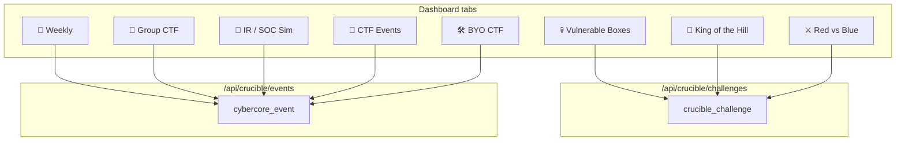
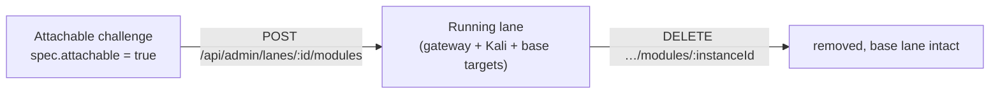

# 07 · Crucible & Challenges

The Crucible is the CTF-style range module — the flagship consumer of the lane
system. This doc explains its two distinct content types (**challenges** vs.
**events**), how the dashboard surfaces them, and how **attachable** challenges
work.

## Challenges vs. events — the core distinction

These are two different tables with two different purposes. Conflating them is
the most common source of confusion.

| | **Challenge** | **Event** |
|---|---|---|
| Table | `crucible_challenge` | `cybercore_event` |
| Is | A reusable, deployable **scenario definition** | A scheduled, human-run **happening** |
| Analogy | A level you can play any time | A tournament with a start/end time |
| Examples | "CyberSaguaros SSRF", a GOAD lab, a single vuln box | A live Friday-night CTF, a KotH match, a red-vs-blue session |
| Deployed as | one or more **lanes** | an event with participants and **scores** |
| Key columns | `challenge_type`, `difficulty`, `subnet_scheme`, `spec` | `event_type`, `starts_at`, `ends_at`, `is_public`, `status` |

**Rule of thumb:** the reusable catalog of things you *can* run lives in
`crucible_challenge`. The live, scheduled, scored competitions live in
`cybercore_event`. A challenge might be *used inside* an event, but they are
tracked separately.

## The dashboard model

The Crucible dashboard ([modules/crucible/public/pages/dashboard.html](../front-end/modules/crucible/public/pages/dashboard.html))
has a left-hand "Challenge Types" nav. Each tab is sourced from **one** of the
two tables:



The three **challenge-backed** tabs map to `challenge_type` values:

| Tab | Reads | `challenge_type` filter |
|-----|-------|-------------------------|
| 💀 Vulnerable Boxes | `crucible_challenge` | `single_vm`, `multi_vm` |
| 👑 King of the Hill | `crucible_challenge` | `koth` |
| ⚔️ Red vs Blue | `crucible_challenge` | `red_vs_blue` |

Everything else reads `cybercore_event`. The mapping is the `CHALLENGE_TABS`
object in the dashboard; the API is
[modules/crucible/routes/challenges.js](../front-end/modules/crucible/routes/challenges.js)
(`GET /api/crucible/challenges?type=…`, scoped to `module_key='crucible'` and,
for non-admins, `status='active'`). Events are served by
[routes/events.js](../front-end/modules/crucible/routes/events.js).

> Because `koth` and `red_vs_blue` challenges may not be seeded yet, those tabs
> show an empty state until challenges of those types exist. That's expected —
> live KotH/RvB *matches* are events; reusable KotH/RvB *ranges* are challenges.

## The challenge `spec`

`crucible_challenge.spec` is a JSONB blob that defines the infrastructure and
scoring. The deploy path (see [05](05-lanes-and-provisioning.md)) reads it to
know what to clone. Common fields:

```jsonc
{
  "attachable": true,             // can be grafted onto a running lane
  "template_node": "cyberhub-node-5",
  "vxlan_block": { "start": 10000, "end": 10009 },  // VXLAN range to allocate from
  "vms": [
    {
      "name": "cybersaguaros",
      "template_vmid": 1703,       // Proxmox template to clone
      "type": "qemu",              // qemu | lxc
      "role": "web",               // web | dc | dmz | workstation | …
      "vm_offset": 600000          // VMID base (default 600000)
    }
  ],
  "goad": { "enabled": true },     // opt into GOAD-specific MAC/IP handling
  "flags": [ { "key": "root", "points": 100 } ]
}
```

- **`vms[]`** drives the clone loop; a single-VM challenge can omit it and fall
  back to a default derived from `challenge_key` + `template_vmid`.
- **`role`** influences networking (e.g. `dmz` gets dual NICs on v3; GOAD roles
  get reserved IPs).
- **`attachable`** flags a challenge that can be hot-attached to an existing lane
  rather than defining a lane of its own (below).

## Attachable challenges

Some challenges aren't standalone lanes — they're **add-ons** grafted onto a
running lane at runtime (the "attached module" mechanism from
[05](05-lanes-and-provisioning.md)). CyberSaguaros is the canonical example.



- Registered like any challenge (`crucible_challenge` row) but with
  `spec.attachable: true`.
- Attach: `POST /api/admin/lanes/:laneId/modules` with
  `{ "challenge_key": "…", "module": "crucible" }`. This clones the challenge's
  VM(s) into a free attached-module slot on the lane's VXLAN
  (`800000 + slot*10000 + vxlan_id`) and adds DHCP reservations on the gateway.
- Detach: `DELETE /api/admin/lanes/:laneId/modules/:moduleInstanceId`, or the
  admin UI **Modules** button. The base lane is untouched.

The full worked example — including the deliberately-vulnerable app, the seed
migration, and the bake script — is the CyberSaguaros challenge in
[challenges/cybersaguaros-ssrf/](../challenges/cybersaguaros-ssrf/) and its
[README](../challenges/cybersaguaros-ssrf/README.md).

## Adding a challenge (checklist)

1. **Build the VM template** on Proxmox (there's often a `bake-*.sh` script in
   [front-end/scripts/](../front-end/scripts/)) and note its VMID.
2. **Register it in the catalog** — add a `cybercore_template_catalog` row (or
   let a bake script do it) so node reconciliation and resolvers can find it.
3. **Seed the `crucible_challenge` row** via a migration — set
   `challenge_key`, `challenge_type`, `difficulty`, `subnet_scheme`, `module_key`,
   `spec`, and `status='active'`. See
   [020_seed_cybersaguaros_module.sql](../front-end/migrations/020_seed_cybersaguaros_module.sql)
   for a template.
4. **Verify it surfaces.** A `single_vm`/`multi_vm` challenge appears under
   Vulnerable Boxes automatically; attachable ones show in the admin lane
   **Modules** flow.

Continue to **[08 · Auth & Security](08-auth-and-security.md)**.
