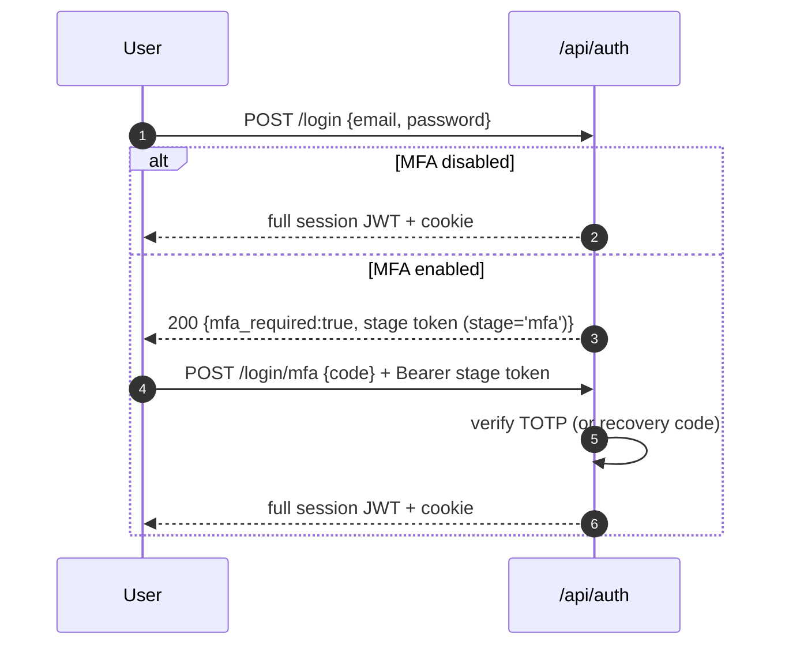

# 08 · Auth & Security

This doc covers how CyberCore authenticates users, enforces roles, does MFA, and
the layered defenses around the app (rate limiting, signed URLs, CSP, the lane
bootstrap trust model).

## Authentication: JWT + session

CyberCore uses **JWTs** as the primary credential, with an **express-session**
(Redis-backed) layer for server-side session state.

- A JWT is accepted from **either** the `Authorization: Bearer <token>` header
  **or** a `token` cookie ([middleware/auth.js](../front-end/src/middleware/auth.js)).
  The header wins if both are present.
- The token payload carries `sub` (user id), `email`, and `role`. On verify,
  those become `req.user = { userId, email, role }`.
- `JWT_SECRET` signs and verifies tokens. If it's unset the server generates a
  random one at boot and **all tokens invalidate on restart** — always set it in
  production ([server.js:94](../front-end/src/server.js#L94)).
- Sessions are stored in Redis via `connect-redis`; the cookie is `httpOnly`,
  `sameSite=lax`, and `secure` when `COOKIE_SECURE=true` (set this behind HTTPS).

### The middleware family

`auth.js` exports several guards for different situations:

| Guard | Use |
|-------|-----|
| `authenticateToken` (alias `authenticate`) | Standard: require a valid full-session JWT (header or cookie). |
| `requireRole(...roles)` | Gate a route to specific roles; returns 403 otherwise. |
| `optionalAuth` | Attach `req.user` if a token is present, but never fail. |
| `authenticateStage(stage)` | Accept **only** a short-lived stage token (`stage: 'mfa'` or `'enroll'`), header-only — used mid-login. Never accepted as a full session. |
| `authenticateEnrollOrSession` | Accept a full session **or** an `enroll` stage token — lets MFA setup serve both logged-in and forced-enrollment users. |

## Roles

Three effective roles flow through the system: **admin**, **instructor**, and a
regular **user** (the code's default fallback is `student`). Admin is the
privileged tier — nearly all `/api/admin/*` routes are gated with
`requireRole('admin')`, and admins are exempt from the general rate limiter.
Instructor unlocks teaching surfaces (CLE dashboards, CiaB instructor tools, some
subnav items marked `roles: ["instructor","admin"]`).

> Course/challenge access checks should go through the shared, admin-aware
> helpers rather than raw `instructor_id` comparisons — an admin must be able to
> manage any course. (See the CLE access-control helper.)

## Login flow with MFA

MFA is TOTP-based (`otplib`), with recovery codes. The login is a two-step
exchange when MFA is enabled, using a short-lived **stage token** so a
half-authenticated request can never act as a full session.

Enrollment (`/mfa/setup` → `/mfa/verify`) issues a QR/secret and confirms the
first code before enabling. `/mfa/disable` requires a full session. Relevant
routes: [auth.js](../front-end/src/routes/auth.js) (`/login`, `/login/mfa`,
`/mfa/setup`, `/mfa/verify`, `/mfa/disable`).

### MFA secret storage

TOTP secrets and recovery codes live on `cybercore_user` (`mfa_secret` BYTEA,
`mfa_recovery_codes` JSONB), encrypted at rest with **pgcrypto** keyed by
`MFA_ENCRYPT_KEY` (falls back to `GUAC_ENCRYPT_KEY`). Helpers are in
[utils/mfa.js](../front-end/src/utils/mfa.js). The columns are ensured
idempotently at boot (`ensureMfaColumns()` in `server.js`).

## Rate limiting

Three limiters, applied in `server.js` (full table in
[02-architecture.md](02-architecture.md)):

- **General** (`/api/*`) — high cap (default 5000/15 min), keyed by user id (or
  IP). **Skips admins** and high-frequency read endpoints (`/api/auth/me`,
  `*/status` polls) so a normal session doesn't exhaust its own bucket.
- **Auth** (`/api/auth/login`, `/register`) — tight (5/15 min), keyed by
  **login email** (falling back to IP) so one attacker on a shared NAT can't lock
  out everyone else.
- **Webhook** (`/api/webhook`) — 10/min by IP.

The `trust proxy` setting is essential here: without it every client collapses
into the proxy's single IP bucket. It also underpins the safe use of
`X-Forwarded-For` for the lane bootstrap check.

## Signed URLs for lab assets

Vulnerable-lab VMs sometimes need to pull payloads from the orchestrator. Those
downloads are served from `/vuln-assets/` and gated by **short-lived HMAC-signed
URLs** ([utils/signed-url.js](../front-end/src/utils/signed-url.js)):

- The orchestrator mints `?token=<hmac>&exp=<ts>` for a filename; the static
  handler verifies the signature and expiry before serving
  ([server.js:311](../front-end/src/server.js#L311)).
- Keyed by `VULN_ASSETS_SECRET`. In production the app refuses to sign with the
  dev fallback — set it (`openssl rand -hex 32`).

## Lane bootstrap trust model

The one unauthenticated endpoint, `GET /api/lane-bootstrap`, is gated by
**source IP + one-shot token + hostname secret** rather than a bearer token,
because a freshly-cloned gateway has no credentials yet. The full rationale is in
[05-lanes-and-provisioning.md](05-lanes-and-provisioning.md) and the header of
[lane-bootstrap.js](../front-end/src/routes/lane-bootstrap.js). Key point: the
source-IP check is only trustworthy *because* `trust proxy` makes Express drop
forged `X-Forwarded-For` from untrusted hops.

## Content-Security-Policy & headers

`helmet` sets security headers with a tuned CSP ([server.js:142](../front-end/src/server.js#L142)):

- `default-src 'self'`; scripts/styles allow `'unsafe-inline'` (and scripts
  `'unsafe-eval'`) — a pragmatic concession to the inline-heavy hub pages.
- `frame-src` is `'self'` plus, when configured, the Guacamole origin — this is
  what allows the console iframe. Same-origin `/guac` proxying needs no addition.
- `img-src` allows `data:` and `blob:` for generated/inline images.

## Secrets checklist (production)

Set all of these — several have insecure dev fallbacks that log warnings:

| Env var | Purpose |
|---------|---------|
| `JWT_SECRET` | Signs session JWTs. Random-per-boot if unset (invalidates tokens on restart). |
| `SESSION_SECRET` | Signs the session cookie. |
| `VULN_ASSETS_SECRET` | HMAC key for `/vuln-assets` URLs. App refuses dev fallback in prod. |
| `MFA_ENCRYPT_KEY` | Encrypts TOTP secrets at rest (falls back to `GUAC_ENCRYPT_KEY`). |
| `GUAC_ENCRYPT_KEY` | Guacamole DB encryption. |
| `PROXMOX_TOKEN_SECRET` | Proxmox API access. |
| `COOKIE_SECURE=true` | Required once traffic is HTTPS. |

Continue to **[09 · Deployment & Ops](09-deployment-and-ops.md)**.
