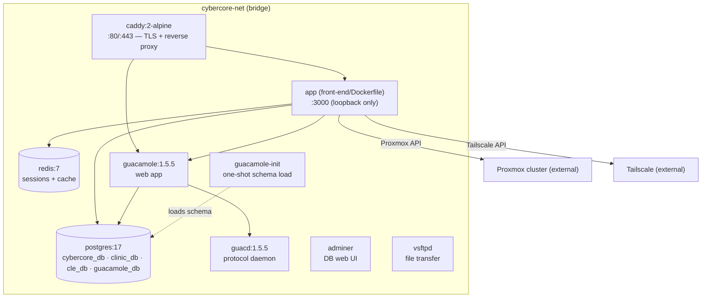

# 09 · Deployment & Ops

How CyberCore is packaged, configured, and run, plus the operational knobs you'll
reach for.

## The Docker Compose stack

Everything runs from [docker-compose.yml](../docker-compose.yml) as a single
stack on the "orchestrator VM." The app is the only custom image; the rest are
stock.



| Service | Image | Role | Exposure |
|---------|-------|------|----------|
| `caddy` | caddy:2-alpine | TLS termination + reverse proxy; the only public entry point | `:80`, `:443` |
| `app` | built from `front-end/` | The CyberCore Express app | `127.0.0.1:3000` (never public) |
| `postgres` | postgres:17 | All databases | internal (+ mapped port) |
| `redis` | redis:7-alpine | Session store + cache | internal |
| `guacd` + `guacamole` | guacamole 1.5.5 | In-browser VM consoles | via Caddy at `/guacamole` |
| `guacamole-init` | postgres:17 | One-shot: loads the Guacamole schema | exits after init |
| `adminer` | adminer:latest | DB admin web UI | mapped port |
| `ftp` | fauria/vsftpd | File transfer for labs | mapped ports |

Key facts:

- **Caddy is the only front door.** The app (`:3000`) and Guacamole are bound to
  loopback / the internal network — all user traffic goes through Caddy, which
  also auto-provisions Let's Encrypt certs in public mode. See
  [offline-mode.md](11-offline-mode.md) for LAN/air-gapped operation.
- **Postgres hosts every database** in one container: `cybercore_db`,
  `clinic_db`, `cle_db`, and `guacamole_db`.
- **`depends_on` health gating:** the app waits for Postgres and Redis to be
  *healthy* and Guacamole to have started before booting.
- **Docker-out-of-Docker:** the app mounts `/var/run/docker.sock` so the CiaB
  vuln-app builder can `docker build`/`save` against the host daemon. This is a
  deliberate, documented trust tradeoff — code execution in the app container
  can reach orchestrator-VM root, but the blast radius is that VM only, not
  Proxmox.

## Configuration

Config comes from three places:

1. **`.env`** (from [example.env](../example.env)) — secrets and host-specific
   values, injected into the compose stack.
2. **[config/site.json](../config/site.json)** — cluster/site topology
   (Proxmox nodes, network plans, scheduling limits), read via
   [utils/site-config.js](../front-end/src/utils/site-config.js) and mounted
   read-only into the container.
3. **Env passed through in `docker-compose.yml`** — the `app` service maps `.env`
   values onto the specific variable names the code expects.

### Environment variable reference

| Variable | Purpose |
|----------|---------|
| `CYBERHUB_HOST` | Public hostname for Caddy (domain = HTTPS; `:80` = HTTP/LAN). |
| `CORE_DB_NAME` / `CORE_DB_USER` / `CORE_DB_PASSWORD` | The `cybercore_db` credentials. |
| `DB_NAME=clinic_db` (+ `DB_*`) | The CiaB/legacy plugin DB (shares the same Postgres/user). |
| `JWT_SECRET`, `SESSION_SECRET` | Token/session signing. **Set explicitly.** |
| `JWT_EXPIRES_IN` | Token lifetime (default `7d`). |
| `COOKIE_SECURE` | `true` behind HTTPS. |
| `VULN_ASSETS_SECRET` | HMAC key for `/vuln-assets` signed URLs. |
| `GUAC_ENCRYPT_KEY`, `MFA_ENCRYPT_KEY` | pgcrypto at-rest encryption (Guac creds, MFA secrets). |
| `GUAC_*` | Guacamole service account, API URL, and DB — mostly preset in compose. |
| `PROXMOX_API_URL` / `PROXMOX_TOKEN_ID` / `PROXMOX_TOKEN_SECRET` | Proxmox API access for provisioning. |
| `TAILSCALE_OAUTH_CLIENT_ID` / `_SECRET` / `TAILSCALE_TAILNET` / `TAILSCALE_LANE_TAG` | Tailscale BYOAB for v2/v3 lanes. |
| `CYBERCORE_INTERNAL_URL` | Internal URL lane web VMs pull vuln-app images from. |
| `ANTHROPIC_API_KEY` / `LLM_DEFAULT_MODEL` / `LLM_MAX_CONCURRENT` | AI generation used by the CiaB plugin ([utils/llm-client.js](../front-end/src/utils/llm-client.js)). |
| `RATE_LIMIT_MAX_REQUESTS` / `RATE_LIMIT_WINDOW_MS` | General rate-limit tuning. |
| `TRUST_PROXY` | Proxy CIDRs Express trusts for real client IP (defaults cover Docker bridges). |

> **Note:** the compose `app` service sets `RATE_LIMIT_MAX_REQUESTS: 100` while
> `example.env` suggests `5000`. The compose value wins at runtime — if active
> users trip the limiter, raise it there. (Admins and high-frequency reads are
> exempt regardless; see [08-auth-and-security.md](08-auth-and-security.md).)

## Bringing it up

```bash
cp example.env .env      # then fill in every REPLACE_ME
docker compose up -d     # build the app image + start the stack
docker compose logs -f app
```

On first boot against an empty Postgres volume, the `config/postgres/*` scripts
seed `cybercore_db` (schema, first admin from `ADMIN_EMAIL`, module rows) and
`guacamole-init` loads the Guacamole schema. The app then loads modules/plugins
(creating `clinic_db` / `cle_db`) and starts listening.

## Database initialization vs. migrations — recap

Three mechanisms, described fully in [03-data-model.md](03-data-model.md):

- **`config/postgres/`** runs once on a fresh Postgres volume (authoritative init
  for `cybercore_db`).
- **`front-end/migrations/`** are incremental `cybercore_db` changes applied
  **manually** (`psql`) — no automatic runner.
- **Plugin migrations** run automatically on boot via the module loader.

## Logging

The app replaces `console.*` with a structured logger
([utils/logger.js](../front-end/src/utils/logger.js)) at the very top of
`server.js`, so all output — including module-load lines — is tagged and leveled.

- Level via `LOG_LEVEL` (`info` default; `debug` for verbose).
- Files under `LOG_DIR` (default `logs/`, mounted to `./logs` on the host).
- Log lines derive their tag from a `[TAG]` prefix convention, so grep by
  subsystem (`[Deploy]`, `[PluginLoader]`, `[RATE LIMIT]`, …).

Request logging ([middleware/request-logger.js](../front-end/src/middleware/request-logger.js))
runs before all routes; activity logging
([middleware/activity-logger.js](../front-end/src/middleware/activity-logger.js))
records auditable admin actions (e.g. lane deploys).

## Operational gotchas

- **Restart invalidates tokens** if `JWT_SECRET`/`SESSION_SECRET` aren't set —
  always set them.
- **DNS ordering matters** for the app container: it lists `1.1.1.1` before the
  lab resolver so `api.tailscale.com` resolves (lab DNS doesn't recurse to the
  internet).
- **Template node drift** is auto-corrected at boot (`syncVmTemplateNodes()`),
  but if a clone fails with "no such VMID on node," re-check the catalog.
- **A broken module won't stop boot** — check the load log for skipped/errored
  modules if a feature is missing.

Continue to **[10 · Plugins: CiaB & CLE](10-plugins.md)**.
